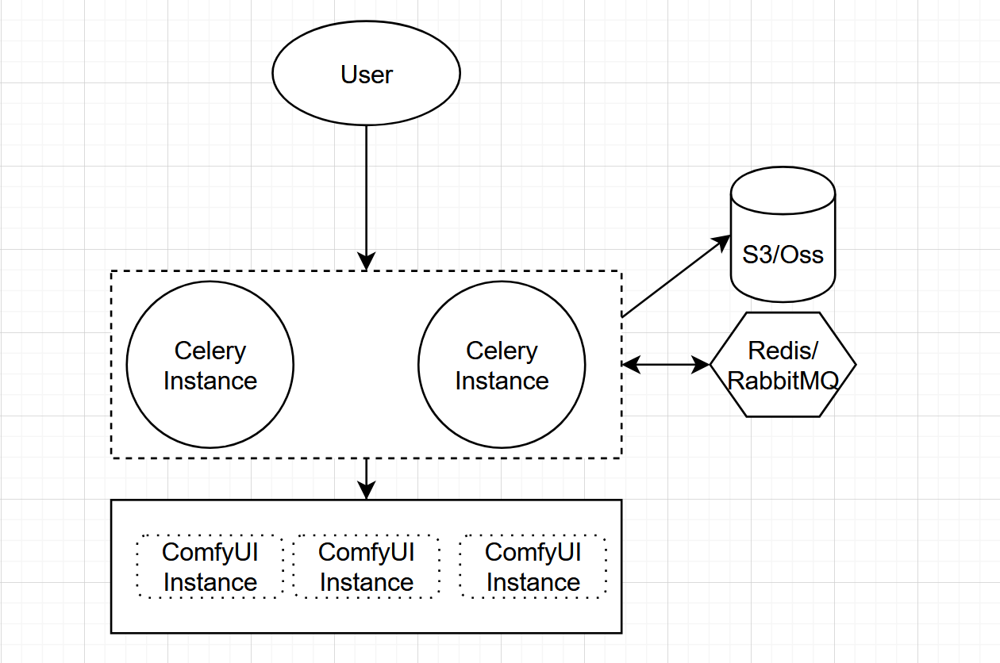

该项目是基于 [FooocusAPI](https://github.com/mrhan1993/FooocusAPI) 的逻辑，对 Fooocus 在 ComfyUI 中的实现

This project is based on [FooocusAPI](https://github.com/mrhan1993/FooocusAPI), the implementation of Fooocus in ComfyUI.

和其他 Fooocus 在 ComfyUI 中的实现不同的是，该项目初衷是更方便的 API 调用，因此在使用上会相对繁琐。

Different from other implementations of Fooocus in ComfyUI, the original intention of this project is to make more convenient API calls, so it will be relatively cumbersome to use.

**已知的问题：**

1. 未使用 ComfyUI 的模型管理器，因此会导致显存有一个常驻的占用。
2. 生成图像的数量将始终为 1，指定的生成数量是将被忽略。

**Known issues:**

1. The model manager of ComfyUI is not used, which will cause a constant occupancy of memory.
2. The number of generated images will always be 1, and the specified number of generations will be ignored.

> 该项目是作为另一个暂未完成的项目的一部分开发的，那是一个基于 Celery 的分布式队列系统，该项目以及 ComfyUI 会作为那个项目的后端 (worker) 存在。

> This project is developed as a part of another unfinished project, which is a distributed queue system based on Celery. This project and ComfyUI will be the backend (worker) of that project.

关于另一个项目的一个简单介绍：

A introduction to another project:

在我的设想中，Celery 仅作为一个 worker 存在，我会在 Celery 的部分完成任务的分发、输入文件的存储、结果的存储和获取。

In my idea, Celery is only a worker, and I will complete the task of task distribution, input file storage, result storage and retrieval in the Celery part.
